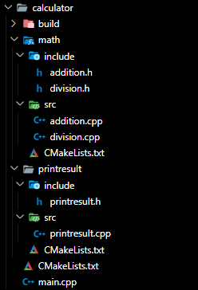

# Cmake

Cmake is a tool for creating buildfile (Makefile).

# Basic structure of a Cmake project

Example we have a project folder like this:



`CMakeLists.txt` of `math` module:

```cmake
add_library(my_math
src/addition.cpp
src/division.cpp)

target_include_directories(my_math PUBLIC include)
```

`CMakeLists.txt` of `printresult` module:

```cmake
add_library(my_print
src/print_result.cpp)

target_include_directories(my_print PUBLIC include)
```

`CMakeLists.txt` of main directory of the project:

```cmake
cmake_minimum_required(VERSION 3.0.0)

project(Calculator_Project VERSION 1.0.0)


add_subdirectory(my_math_dir)

add_subdirectory(my_print_dir)


add_executable(calculator
main.cpp)


target_link_libraries(calculator PUBLIC my_math  my_print)
```

# Variable

We declare variables like this:
```cmake
set(DEBUG True)
set(WARNING_AS_ERRORS True)
set(VERSION 10)
```

We get the value of variables like this:
```cmake
${VARIABLE}
```

With below example we can run cmake with command `cmake -DCMAKE_BUILD_TYPE=Debug ..
`
```cmake
cmake_minimum_required(VERSION 3.0.0)

# Set the project name
project (my_project)

# Set the C++ standard
set(CMAKE_CXX_STANDARD 11)
set(CMAKE_CXX_STANDARD_REQUIRED True)

# Set the source files
set(SOURCES main.cpp)

# Add an executable
add_executable(my_project ${SOURCES})

if(CMAKE_BUILD_TYPE MATCHES Debug)
    message("Debug build.")
    set(CMAKE_CXX_FLAGS "${CMAKE_CXX_FLAGS} -Wall -g")
elseif(CMAKE_BUILD_TYPE MATCHES Release)
    message("Release build.")
    set(CMAKE_CXX_FLAGS "${CMAKE_CXX_FLAGS} -O3")
endif()
```

# Loops, Function, Macro
Example of __looping__:
```cmake
# Set a counter variable
set(counter 0)

# Start the while loop
while(counter LESS 5)
    # Print a message
    message("Counter: ${counter}")

    # Increment the counter
    math(EXPR counter "${counter} + 1")
endwhile()
```
```cmake
# Set a list of values
set(my_list "apple" "banana" "cherry")

# Start the foreach loop
foreach(item IN LISTS my_list)
    # Print a message
    message("Item: ${item}")
endforeach()
```

Example of __function__:
```cmake
# Define a function
function(print_message message)
    # Print the message
    message("${message}")
endfunction()

# Call the function
print_message("Hello, World!")
```

Example of __macro__:
```cmake
# Define a macro
macro(print_message message)
    # Print the message
    message("${message}")
endmacro()

# Call the macro
print_message("Hello, World!")
```

_Macros is same as functions but do not have their own scope, so any variables defined or modified inside a macro will affect the parent scope._

# Package
Example of using OpenCV package in the project:
```cmake
cmake_minimum_required(VERSION 3.0.0)
project(DisplayImage)

find_package(OpenCV REQUIRED)

add_executable(DisplayImage main.cpp)

target_include_directories(DisplayImage PRIVATE ${OpenCV_INCLUDE_DIRS})
target_link_libraries(DisplayImage PRIVATE ${OpenCV_LIBS})

message("OpenCV Include Directories: "${OpenCV_INCLUDE_DIRS})
message("OpenCV Libraries: "${OpenCV_LIBS})
```

Example of using modules:
```cmake
cmake_minimum_required(VERSION 3.0.0)

project(GTK_FindModule)

# Set the CMAKE_MODULE_PATH variable
set(CMAKE_MODULE_PATH ${CMAKE_MODULE_PATH} "${CMAKE_SOURCE_DIR}/cmake/modules")

# Or append path to CMAKE_MODULE_PATH:
# list(APPEND CMAKE_MODULE_PATH ${CMAKE_SOURCE_DIR}/cmake/modules)

# Call the FindGTK.cmake script
find_package(GTK REQUIRED)

if(NOT GTK3_FOUND)
	message(FATAL_ERROR "GTK3 not found")
endif()

add_executable(${PROJECT_NAME}_app  main.cpp)

target_include_directories(${PROJECT_NAME}_app  PRIVATE  ${GTK3_INCLUDE_DIRS})
target_link_libraries(${PROJECT_NAME}_app  PRIVATE  ${GTK3_LIBRARIES})
```

# Using Cmake variable in C++ code

Add define in CMakeLists.txt:
```cmake
add_definitions(-DSOMEVARIABLENAME="${CMAKE_SOURCE_DIR}")
```

Then use it in C++ code:
```c++
#ifdef SOMEVARIABLENAME
    do_something()
#endif
```

# Complete CMakeLists.txt of a project
```cmake
# Set the minimum required version of CMake
cmake_minimum_required(VERSION 3.5)

# Set the project name
project(my_project)

# Set the C++ standard
set(CMAKE_CXX_STANDARD 11)
set(CMAKE_CXX_STANDARD_REQUIRED True)

# Check the build type
if(CMAKE_BUILD_TYPE MATCHES Debug)
    message("Debug build.")
elseif(CMAKE_BUILD_TYPE MATCHES Release)
    message("Release build.")
endif()

# Check the platform
if(WIN32)
    add_definitions(-DWIN32)
elseif(UNIX)
    add_definitions(-DUNIX)
endif()

# Check the compiler
if(CMAKE_CXX_COMPILER_ID MATCHES "GNU")
    set(CMAKE_CXX_FLAGS "${CMAKE_CXX_FLAGS} -Wall -Wextra")
elseif(CMAKE_CXX_COMPILER_ID MATCHES "MSVC")
    set(CMAKE_CXX_FLAGS "${CMAKE_CXX_FLAGS} /W4")
endif()

# Find an external package
find_package(Boost REQUIRED)

# Add subdirectories
add_subdirectory(src)
add_subdirectory(lib)

# Set the source files
set(SOURCES main.cpp)

# Add an executable
add_executable(my_project ${SOURCES})

# Link libraries
target_link_libraries(my_project my_library ${Boost_LIBRARIES})
```
